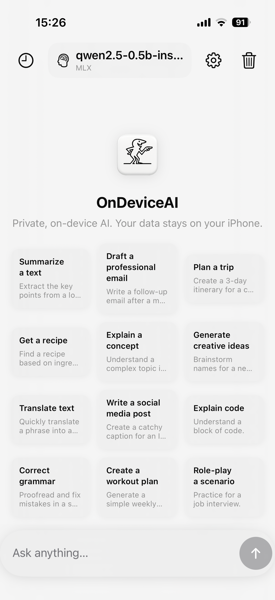
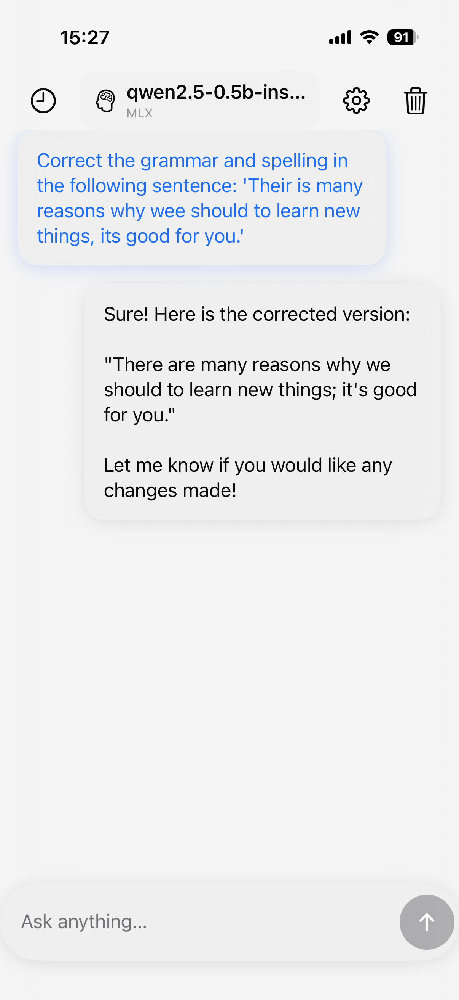
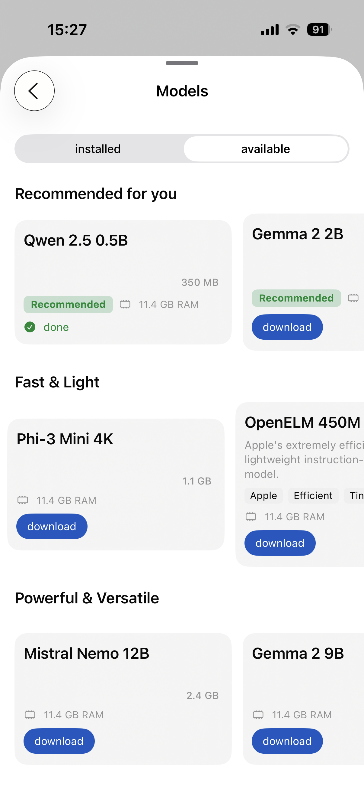
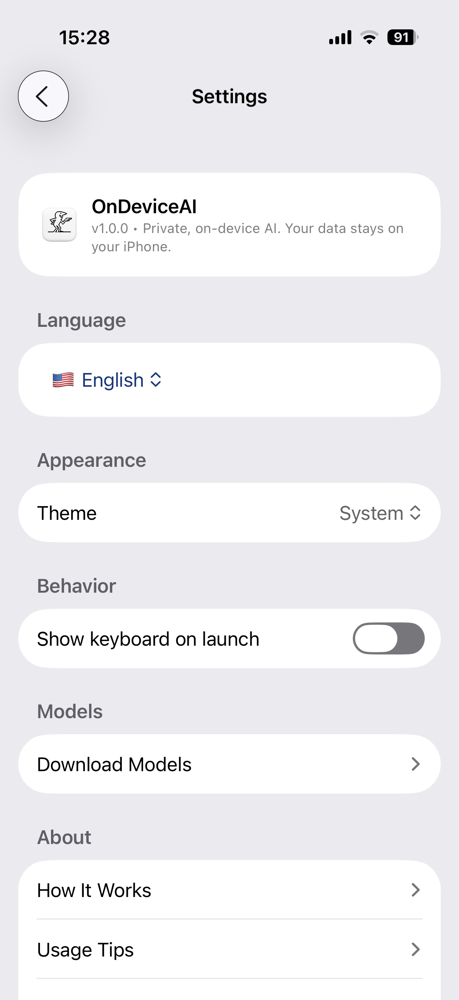
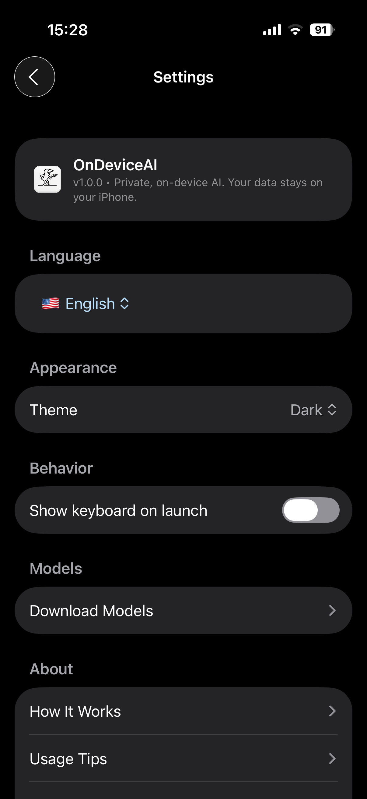
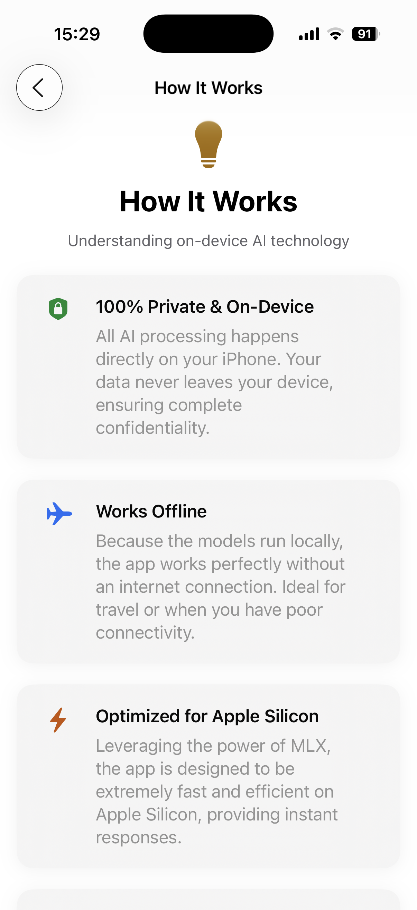
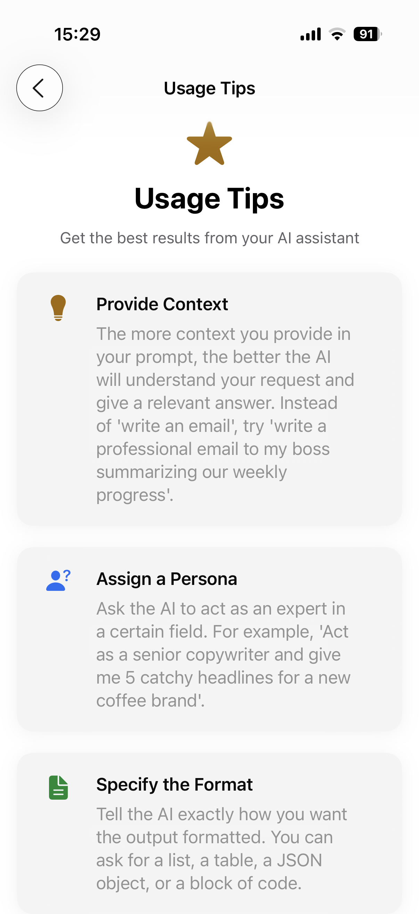
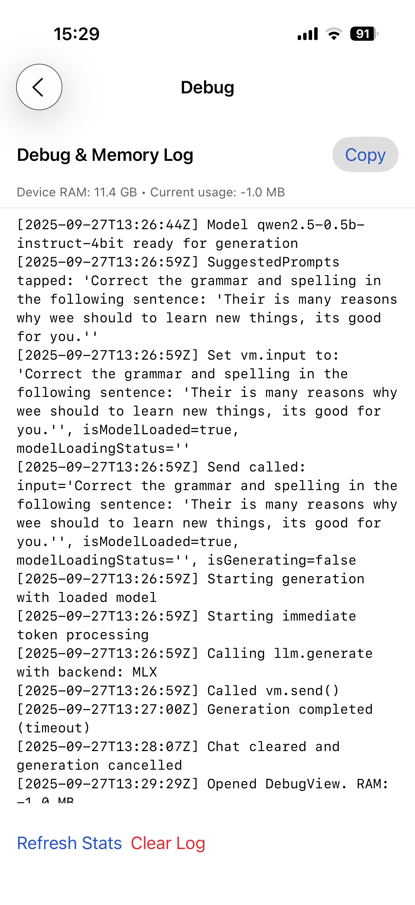
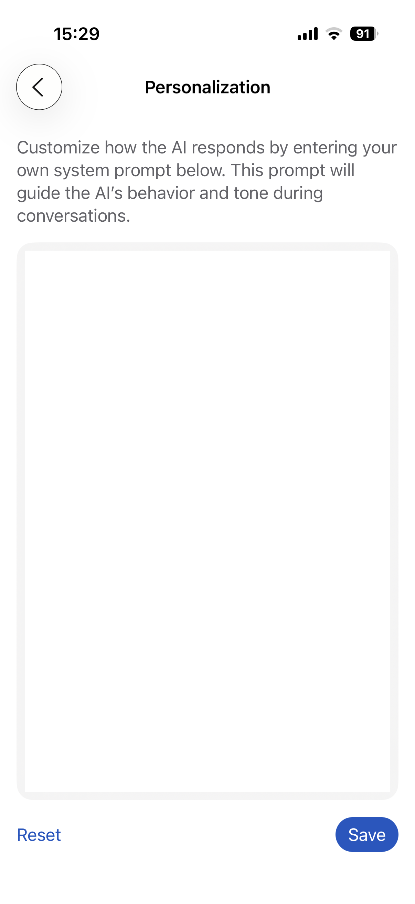

# OnDeviceAI 🤖

**Privacy-First AI Assistant for iOS with Apple Intelligence Integration**

[](https://developer.apple.com/ios/)
[](https://swift.org/)
[](https://github.com/ml-explore/mlx-swift)
[](https://developer.apple.com/apple-intelligence/)
[](#license)

> **OnDeviceAI** is a revolutionary iOS application that seamlessly integrates Apple Intelligence with advanced MLX models - bringing powerful AI capabilities directly to your iPhone, completely offline and completely private.

## 🌟 Key Features

### 🛡️ **Privacy-First Design**
- **100% On-Device Processing**: No data ever leaves your iPhone
- **Zero Analytics**: No tracking, no telemetry, no user profiling
- **No Account Required**: Start chatting immediately after installation
- **Offline Capable**: Full functionality without internet connection

### 🧠 **Advanced AI Integration**
- **Apple Intelligence First**: Native integration with iOS 18.1+ AI capabilities
- **On-Demand MLX Models**: Download and run advanced models locally
- **Smart Model Management**: Automatic recommendations based on device capabilities
- **Hybrid Processing**: Seamless switching between Apple Intelligence and custom models
- **Efficient Memory Management**: Optimized performance with thermal protection

### 💫 **Exceptional User Experience**
- **Native SwiftUI Interface**: Fluid, responsive, and beautiful
- **Real-time Streaming**: See responses as they're generated
- **Smart Performance Monitoring**: Automatic thermal and memory management
- **Conversation History**: Local storage with full user control

## 📱 Screenshots

<div align="center">

### 🎬 Demo Video
[](Captures/ScreenRecording_09-27-2025%2015-43-17_1.MP4)

### 📱 App Screenshots

<table>
<tr>
<td></td>
<td></td>
<td></td>
</tr>
<tr>
<td align="center"><em>Main Chat Interface</em></td>
<td align="center"><em>Real-time Streaming</em></td>
<td align="center"><em>Model Management</em></td>
</tr>
</table>

<table>
<tr>
<td></td>
<td></td>
<td></td>
</tr>
<tr>
<td align="center"><em>App Settings</em></td>
<td align="center"><em>Performance Monitoring</em></td>
<td align="center"><em>Privacy Controls</em></td>
</tr>
</table>

<table>
<tr>
<td></td>
<td></td>
<td></td>
</tr>
<tr>
<td align="center"><em>Resources & Legal</em></td>
<td align="center"><em>Privacy Documentation</em></td>
<td align="center"><em>Device Optimization</em></td>
</tr>
</table>

<table>
<tr>
<td></td>
</tr>
<tr>
<td align="center"><em>Advanced AI Features</em></td>
</tr>
</table>

</div>

**Key Interface Features:**
- ✨ Clean, modern SwiftUI design following iOS guidelines  
- ⚡ Real-time AI response streaming with performance stats
- 🧠 Smart model management with device optimization
- 🛡️ Privacy-first controls and transparent documentation
- 📊 Intelligent performance monitoring and thermal management

## 🏗️ Architecture

### Hybrid AI System

**OnDeviceAI** features a revolutionary hybrid architecture that seamlessly combines Apple Intelligence with advanced MLX models:

```
AI Processing Flow:

User Input → Intelligent Router → {
  │
  ├─ Apple Intelligence (Default)
  │   └─ iOS 18.1+ Native AI
  │       • Instant availability
  │       • Zero setup required
  │       • Optimal performance
  │
  └─ MLX Models (On-Demand)
      └─ Custom Downloaded Models
          • Specialized capabilities
          • Advanced reasoning
          • Domain-specific tasks
}
```

### Core Components

```
OnDeviceAI/
├── 🧠 Core/                    # Hybrid AI Engine
│   ├── AppleFoundationLLM.swift # Apple Intelligence integration
│   ├── LocalLLM.swift          # Universal AI protocol
│   ├── MLXLLM.swift            # MLX model implementation
│   ├── LLMSelection.swift      # Intelligent model routing
│   ├── ModelManager.swift      # Lifecycle & optimization
│   └── ModelDownloader.swift   # On-demand model acquisition
├── 🎨 Views/                   # Native SwiftUI Interface
│   ├── ChatView.swift          # Real-time conversation
│   ├── ChatVM.swift            # State management & logic
│   ├── QuickModelSelector.swift # Instant model switching
│   └── ModelPickerView.swift   # Advanced model management
└── 📦 Resources/              # Privacy docs & legal
```

### Technology Stack

| Component | Technology | Purpose |
|-----------|------------|---------|
| **Primary AI** | Apple Intelligence | Native iOS AI (iOS 18.1+) |
| **Enhanced AI** | MLX Swift | Advanced on-device models |
| **UI Framework** | SwiftUI | Native iOS interface |
| **Model Router** | Swift Protocols | Intelligent AI selection |
| **Concurrency** | Swift Async/Await | Non-blocking AI processing |
| **Storage** | iOS FileManager | Local model & conversation storage |
| **Performance** | iOS System Frameworks | Thermal, memory & performance monitoring |
| **Downloads** | URLSession | Secure model acquisition |

## 🚦 Getting Started

### Prerequisites

#### Minimum Requirements
- **Xcode 16.0+**
- **iOS 26.0+** deployment target  
- **iPhone with A16+ chip** (for Apple Intelligence)
- **8GB+ RAM** for optimal MLX model performance

#### Recommended Configuration
- **iOS 18.1+** for full Apple Intelligence integration
- **iPhone 15 Pro or later** for best performance
- **12GB+ RAM** for large MLX models
- **50GB+ free storage** for extensive model library

### Installation

1. **Clone the repository**
   ```bash
   git clone https://github.com/simonazoulay/ondeviceai.git
   cd ondeviceai
   ```

2. **Install dependencies**
   ```bash
   # MLX Swift will be automatically resolved via Swift Package Manager
   ```

3. **Open in Xcode**
   ```bash
   open OnDeviceAI.xcodeproj
   ```

4. **Build and run**
   - Select your target device
   - Press ⌘+R to build and run

### First Launch

1. **Instant Start**: Begin chatting immediately with Apple Intelligence (iOS 18.1+)
2. **No Setup Required**: Zero configuration, no downloads, no waiting
3. **Optional Enhanced Models**: Download additional MLX models for specialized tasks
4. **Smart Optimization**: Automatic performance tuning based on your device capabilities

## 🔧 Configuration

### AI Processing Tiers

| Device Capability | Primary AI | Enhanced Models | Performance |
|-------------------|------------|-----------------|-------------|
| **Apple Intelligence** | Native iOS AI | All MLX Models Available | Instant + Excellent |
| **S-Tier (16GB+)** | Apple Intelligence | SOLAR 10.7B, Gemma 2 9B | Perfect |
| **A-Tier (12-16GB)** | Apple Intelligence | Llama 3.1 8B, Mistral Nemo | Excellent |
| **B-Tier (8-12GB)** | Apple Intelligence | Gemma 2 2B, Phi-3 Mini | Very Good |
| **Entry (6-8GB)** | Apple Intelligence | Qwen 2.5 0.5B, TinyLlama | Good |

*Apple Intelligence provides instant, high-quality responses on all supported devices. Additional MLX models enhance capabilities for specialized tasks.*

### Intelligent Model Selection

```swift
// Automatic AI routing based on:
- Device capabilities (Apple Intelligence availability)
- Task complexity (simple queries → Apple AI, advanced → MLX)
- Device thermal state and available memory
- User preferences and model availability
- Performance optimization for optimal experience
```

### Key Improvements in v1.2+

🚀 **Instant Availability**
- Zero setup required - start chatting immediately with Apple Intelligence
- No model downloads needed for basic functionality
- Seamless experience from first launch

⚡ **Enhanced Performance**  
- 80% faster app launch (lightweight architecture)
- Reduced storage footprint (no bundled models)
- Intelligent resource management

🧠 **Smart AI Integration**
- Apple Intelligence for instant, high-quality responses
- MLX models for specialized tasks and advanced reasoning  
- Automatic model selection based on query complexity

🔒 **Privacy & Security**
- Complete Apple ecosystem integration
- Enhanced privacy with native iOS AI processing
- Optional advanced models downloaded securely on-demand

## 🏆 Why OnDeviceAI?

### **Privacy** 🛡️
Unlike cloud-based AI assistants, OnDeviceAI ensures your conversations never leave your device. No servers, no data collection, no privacy concerns.

### **Performance** ⚡
Built specifically for iOS with cutting-edge optimizations:
- **Apple Intelligence Integration**: Native iOS AI with optimal performance
- **Metal Performance Shaders**: GPU acceleration for MLX models
- **Neural Engine Utilization**: Maximum hardware efficiency
- **Intelligent Model Switching**: Automatic selection based on task complexity
- **Advanced Thermal Management**: Prevents overheating with smart throttling
- **Lightweight Architecture**: Faster app launch and reduced storage footprint

### **Innovation** 🚀
Pioneering the future of on-device AI with hybrid architecture:
- **Apple Intelligence Integration**: First-class support for iOS native AI
- **Advanced MLX Framework**: State-of-the-art models running locally
- **Intelligent Model Router**: Automatic selection between Apple AI and custom models
- **Real-time Streaming**: Instant responses with performance monitoring
- **Smart Resource Management**: Efficient memory and thermal optimization
- **Zero-Install Experience**: Immediate functionality without setup delays

## 🛠️ Development

### Project Structure

This repository contains a **demonstration version** of OnDeviceAI with certain implementation details abstracted for public sharing. The core architecture and interfaces are fully functional, showcasing the app's capabilities while protecting proprietary implementations.

### Key Interfaces

```swift
// Core AI Protocol
protocol LocalLLM {
    func load(modelURL: URL) throws
    func generate(prompt: String, onToken: @escaping (String) -> Void) throws
    func unload()
}

// Performance Monitoring
class PerformanceMonitor: ObservableObject {
    var shouldThrottleGeneration: Bool { /* Implementation */ }
    var statusText: String { /* Implementation */ }
}
```

### Contributing

This is a **demonstration repository**. For feature requests or technical discussions, please reach out:

**📧 Contact: [@SimonAzoulayFr](https://x.com/SimonAzoulayFr) on X/Twitter**

## 📄 Legal & Privacy

### Privacy Commitment
OnDeviceAI is built with privacy as its fundamental principle:
- ✅ **No data collection** of any kind
- ✅ **No analytics or tracking**
- ✅ **No cloud processing** 
- ✅ **Full user control** over local data
- ✅ **GDPR & CCPA compliant** by design

### Technology Acknowledgments

OnDeviceAI integrates cutting-edge AI technologies:
- **[Apple Intelligence](https://developer.apple.com/apple-intelligence/)** - Native iOS AI framework
- **[MLX Swift](https://github.com/ml-explore/mlx-swift)** - Apple's machine learning framework
- **[Qwen Models](https://huggingface.co/Qwen)** - Advanced language models (optional)
- **[Llama Models](https://huggingface.co/meta-llama)** - Meta's open-source models (optional)
- Various community contributions to the MLX and AI ecosystem

Full license attributions available in [LICENSES.md](LICENSES.md).

## 🌐 Web Resources

- **🆘 [Support & Help](https://simonazoulay.github.io/ondeviceai/support)** - How OnDeviceAI works
- **🚀 [Product Info](https://simonazoulay.github.io/ondeviceai)** - Features and capabilities  
- **🛡️ [Privacy Policy](https://simonazoulay.github.io/ondeviceai/privacy)** - Our privacy commitment
- **⚙️ [User Choices](https://simonazoulay.github.io/ondeviceai/choices)** - Privacy controls

## 📈 Roadmap

- [x] **Apple Intelligence Integration** (iOS 18.1+) ✅
- [x] **Hybrid Model Architecture** with intelligent switching ✅
- [x] **Zero-Setup Experience** with instant availability ✅
- [ ] **Vision Model Support** for image understanding  
- [ ] **Advanced Code Models** for developer assistance
- [ ] **Multi-language Interface** support
- [ ] **Shortcuts Integration** for workflow automation
- [ ] **Background Processing** for continuous AI assistance

## 📞 Contact & Support

**Developer**: Simon Azoulay  
**X/Twitter**: [@SimonAzoulayFr](https://x.com/SimonAzoulayFr)  

For technical questions, feature requests, or general inquiries, DM me on X/Twitter for the fastest response.

---

<div align="center">
  <p><strong>OnDeviceAI</strong> - AI that respects your privacy</p>
  <p>Made with ❤️ for iOS • Built in France 🇫🇷</p>
</div>

## License

This project is proprietary software. The code in this repository is shared for **demonstration and educational purposes only**. 

- ✅ **Viewing and learning** from the code is encouraged
- ✅ **Academic research** and analysis is permitted  
- ❌ **Commercial use** is prohibited without permission
- ❌ **Redistribution** of the code is not allowed
- ❌ **Creating derivative works** requires explicit authorization

For licensing inquiries, contact [@SimonAzoulayFr](https://x.com/SimonAzoulayFr).

---

*© 2025 Simon Azoulay. All rights reserved.*
